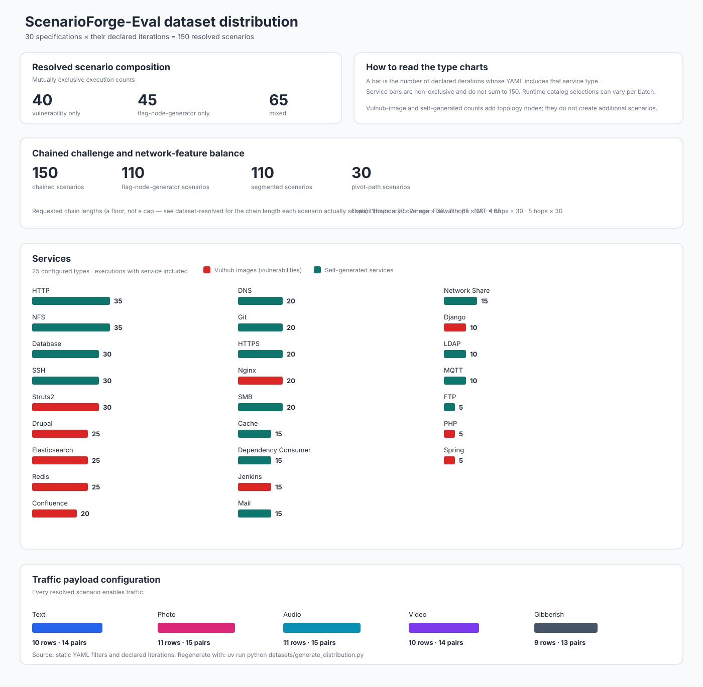

# Cybersecurity evaluation dataset

This directory is a 150-execution dataset suite for ScenarioForge-Eval. The 30
specifications each declare five iterations, so a full evaluator batch resolves
exactly 150 scenarios—not more than 150. Vulnerability and
flag-node-generator counts add nodes within a scenario; they do not add
evaluator iterations.



The figure covers the complete suite: every scenario contains traffic and at
least one vulnerability or flag-node-generator family. The combined **Services**
chart groups every configured type: red bars are Vulhub-image vulnerabilities
and teal bars are self-generated services. Bars are non-exclusive configured
coverage, because the concrete installed catalog entry is selected at runtime.

Regenerate it after changing a dataset spec:

```bash
uv run python datasets/generate_distribution.py
```

```bash
uv run scenarioforge-eval datasets --sf-path ../scenarioforge --execute \
  --out /tmp/scenarioforge-eval-dataset
```

For a reproducible, one-file-per-iteration form of this suite, generate and
run `../dataset-resolved` instead. It fixes the ranges and evaluator
randomization choices while keeping the source suite concise:

```bash
uv run python datasets/generate_resolved_specs.py
uv run scenarioforge-eval dataset-resolved --sf-path ../scenarioforge --execute
```

| Family | Specs | Executions | Purpose |
| --- | ---: | ---: | --- |
| `10` vulnerability families | 7 | 35 | Web, CMS, DevOps, perimeter, data, cache, and collaboration vulnerabilities |
| `20` artifact families | 7 | 35 | Web, access, identity, share, data, messaging, and dependency artifacts |
| `30` mixed attack paths | 9 | 45 | Vulnerability and flag-node-generator combinations with flows |
| `40` scale and composition | 3 | 15 | Multi-vulnerability, multi-artifact, and large combined enterprise scenarios |
| `50` segmentation and pivots | 4 | 20 | Explicit Firewall/NAT boundaries, including pivot-enabled mixed paths |

The `50` segmentation-and-pivot family supplies the largest dedicated network
cases:

- `51-segmented-nat-artifacts.spec.yaml`: NAT and artifact-only cases.
- `52-segmented-mixed-perimeter.spec.yaml`: Mixed perimeter cases without pivots.
- `53-segmented-firewall-pivot.spec.yaml`: Firewall pivot paths using an SSH fallback provider.
- `54-segmented-enterprise-pivots.spec.yaml`: Large mixed enterprise paths with Firewall and NAT pivots.

Those features are not isolated to the `50` family. Smaller pivot paths also
appear in `13`, `22`, `31`, and `41`, covering vulnerability,
flag-node-generator, and SSH-fallback providers across vulnerability-only,
artifact-only, mixed, and scale scenarios.

The suite is balanced by exposure type: 40 vulnerability-only executions, 45
flag-node-generator-only executions, and 65 mixed executions. The combined
Services distribution shows all 25 configured types: 10 Vulhub-image
vulnerability types and 15 self-generated service types. Their coverage totals
are intentionally non-exclusive: one scenario can configure several types.
Filters name stable enabled catalog families, while each evaluator iteration
randomly selects an eligible concrete vulnerability or generator from that
family. Counts, topology sizes, services, flows, and segmentation vary across
the suite to provide realistic scenario and artifact diversity.

Traffic is enabled in every specification: 30 specifications and 150
executions. The profiles are balanced across nine light (45 executions), 11
medium (55 executions), and 10 heavy (50 executions) scenario families. Every
named profile resolves to explicit ScenarioForge Traffic XML rows, rather than
leaving runtime behavior to an unspecified random choice.

The light profile selects up to 35% of eligible hosts and creates one periodic
TCP pair at 32 KB/s with five-second periods and 10% jitter. Medium traffic
selects up to 60% of hosts and combines one continuous 128 KB/s TCP pair with
one periodic 64 KB/s UDP pair. Heavy traffic selects up to 85% of hosts and
creates two continuous 512 KB/s TCP pairs plus two bursty 256 KB/s UDP pairs.
These row counts are absolute sender/receiver-pair requests, while density
controls the portion of eligible nodes considered for traffic generation.

Each traffic-enabled YAML additionally declares `traffic.payload_types`, which
deterministically replaces the profile defaults for its concrete Traffic rows.
The suite covers all supported ScenarioForge payload shapes: text, photo,
audio, video, and gibberish. Across the 51 traffic row definitions, there are
11 each of photo and audio, 10 each of text and video, and nine gibberish rows;
when weighted by requested sender/receiver pairs, the allocation is 14, 15, 15,
14, and 13 pairs, respectively. This keeps content realism and opaque/random-byte
traffic represented without coupling any payload type to one vulnerability or
artifact family.

The unit of analysis is one resolved evaluator iteration, rather than one YAML
file. Each iteration receives a fresh seed, resolves every bounded count and
topology range, and records the resulting selection in its output metadata.
This gives repeated samples within a scenario family without making every run
identical. The fixed five-iteration allocation keeps the dataset balanced at
the family level while still allowing the enabled ScenarioForge catalogs to
supply concrete, current examples.

Scenario scale spans from small single-family profiles with 3--8 base Docker
hosts to large enterprise profiles with 3–5 routers and 10–16 base Docker
hosts. Most profiles occupy the small-to-medium range of 3--8 hosts and
1--2 routers, while the `37`, `38`, and `40`--`42` families cover larger
multi-router deployments. Vulnerability and flag-node-generator nodes are
topology additions, so the largest combined scenarios may add 2–5 selected
vulnerabilities and 3–6 selected artifact generators beyond their base host
count. Service counts vary from one to eight SSH/HTTP assignments, providing
both sparse and service-rich host configurations.

The vulnerability-only portion samples common research-relevant application
classes: web frameworks, CMS deployments, CI/CD tooling, reverse proxies,
search/data platforms, caches, and collaboration services. Artifact-only
profiles span web and HTTPS content, SSH and Git credentials, DNS/LDAP identity
data, NFS/SMB shares, database and cache records, mail/MQTT/FTP messages, and
dependency-consumer evidence. Mixed profiles deliberately pair these classes
into plausible attack-path contexts, such as web exploitation with delivery
artifacts, a CMS with remote-access material, CI with source-control artifacts,
or data-service vulnerabilities with shares and database evidence.

Flows and segmentation introduce structure beyond independent nodes. Every
specification is chained, so no scenario resolves to zero challenges. Each
spec's `chain_length` is a request, not a guarantee: none of these
specifications configure the topology "slot" nodes
(`vulnerability_slots`/`flag_gen_slots`) that would let the flag-sequencing
solver leave a node out of the chain, so every topology-placed vulnerability
and flag-node-generator is mandatory, and the chain actually solved is the
full count of those nodes — `vulns.count` plus `flag_node_generators.count`,
resolved per iteration. `dataset-resolved` computes that real per-scenario
length (see its README) rather than trusting the declared field, since a
declared length below that total is silently exceeded, not enforced. Every
chain is still duplicate-free.

Segmentation is similarly distributed rather than confined to one family: 22
specifications (110 scenarios) declare explicit boundary rows. Across the
source suite, Firewall and NAT each occur in 65 scenarios. Six specifications
(30 scenarios) enable pivots and request topology-pivot inclusion: `13`, `22`,
`31`, `41`, `53`, and `54`. This supports controlled comparisons among
chained, segmented, and pivot-expanded challenges without coupling network
complexity to only the largest topologies.

The evaluator writes those explicit segmentation rows into scenario XML, so
the dataset distinguishes a simple density request from an actual boundary
topology. ScenarioForge's web flow-sequencing UI already honors the stored
topology-pivot setting. Evaluator-driven expansion of those pivots will require
the matching ScenarioForge CLI option to be added in the ScenarioForge
repository; until then, the pivot rows are generated but the CLI flow phase
does not automatically extend its sequence for them.
